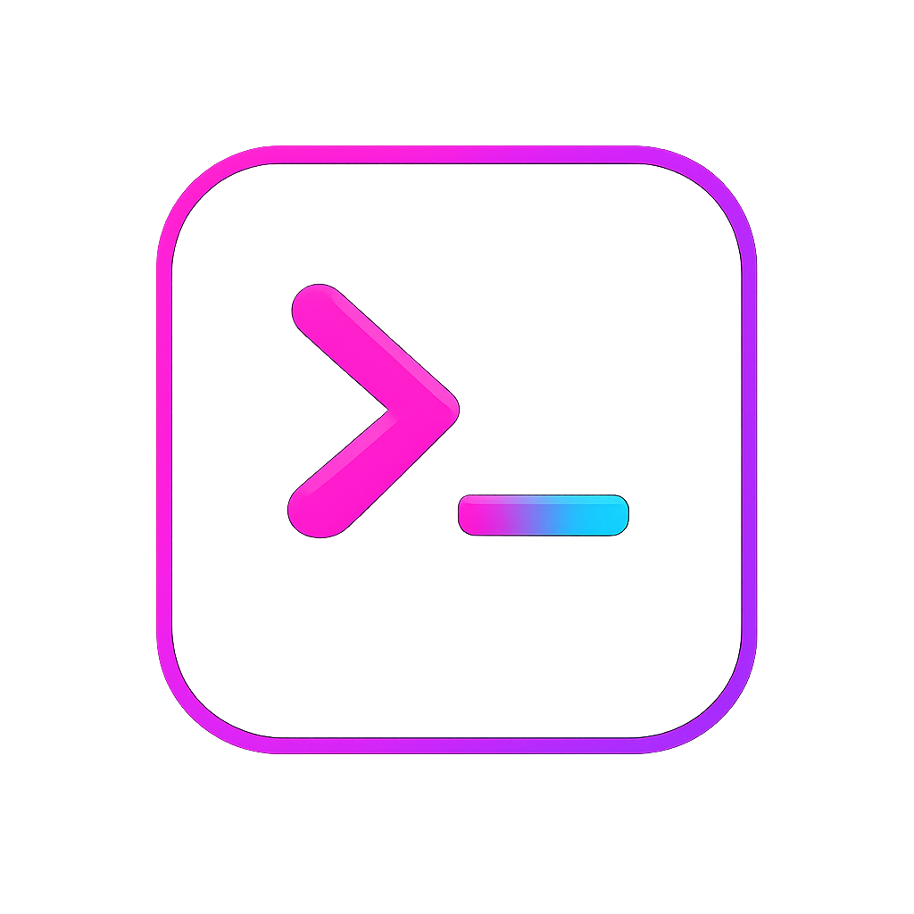

# Tessera

<p align="center">
  
</p>

Build terminal apps that feel like real products, not throwaway demos.

Tessera is a C#-first terminal UI framework for `.NET 10`. It gives you a small public app model, first-class controls and layouts, semantic theming, and enough structure to build serious terminal software without dragging you into a host-heavy framework story.

Tessera is in public alpha. It is ready for evaluation, experimentation, and contribution. Breaking changes are still allowed when they simplify the long-term public path.

## Why Tessera

- explicit C# object model instead of a nested layout DSL
- no DI container or Generic Host required for the normal path
- built-in controls, layouts, themes, and runtime options
- state-driven app model with `TesseraApp`, `Update(...)`, and `Build(...)`
- advanced hosting seams available when needed, but not forced on beginners
- public examples that aim to look like products, not widget dumps

## What You Get

- a small startup story: `TesseraApplication.RunAsync(...)` or `TesseraApplication.CreateBuilder()`
- default authoring namespaces: `Tessera`, `Tessera.Controls`, `Tessera.Layout`, `Tessera.Styles`
- a broad built-in widget catalog for dashboards, forms, workflows, data surfaces, and overlays
- semantic theme tokens and override layers
- public examples that cover starter apps, dashboards, workbench shells, and command-heavy apps
- regression and integration coverage around the public contract

## Start Here

1. Read [docs/overview.md](docs/overview.md).
2. Follow [docs/install-and-prerequisites.md](docs/install-and-prerequisites.md).
3. Build the sample from [docs/first-app.md](docs/first-app.md).
4. Run the onboarding ladder from [docs/examples.md](docs/examples.md): `HelloWorld`, `CounterForm`, `WorkspaceApp`.
5. Open [docs/showcase.md](docs/showcase.md) for the flagship evaluation path.
6. Use [docs/app-model.md](docs/app-model.md), [docs/layout-and-screen-composition.md](docs/layout-and-screen-composition.md), [docs/runtime-and-screen-options.md](docs/runtime-and-screen-options.md), and [docs/architectural-review.md](docs/architectural-review.md) when you need the deeper concepts.
7. If you want to contribute, read [CONTRIBUTING.md](CONTRIBUTING.md) and [docs/architecture-overview.md](docs/architecture-overview.md).

## Quick Start

```csharp
using Tessera;
using Tessera.Controls;
using Tessera.Layout;

var app = TesseraApplication.CreateBuilder()
    .UseApp<CounterApp>()
    .ConfigureRuntime(static runtime =>
    {
        runtime.MaxFps = 60;
        runtime.Screen = new ScreenOptions
        {
            AltScreen = true,
            WindowTitle = "Counter",
        };
    })
    .Build();

await app.RunAsync();

internal sealed class CounterApp : TesseraApp
{
    private readonly CounterState _state = new();
    private readonly Button _increment = new()
    {
        Text = "Increment",
    };
    private readonly StatusBar _status = new();

    public CounterApp() => _increment.Activated += (_, _) => _state.Count++;

    public override TesseraEffect? Update(Message message)
        => message is KeyPressed key && key.IsCharacter('c', ModifierKeys.Ctrl)
            ? TesseraEffects.Quit
            : null;

    public override Screen Build(ScreenContext context)
    {
        _status.LeftText = $"Count: {_state.Count}";
        _status.RightText = "Enter increments   Ctrl+C quits";

        return Screen.Build(window =>
        {
            window.Padding(1);
            window.Footer(1, _status);
            window.Body(body => body.Center(_increment, width: 20, height: 3));
        });
    }
}

internal sealed class CounterState
{
    public int Count { get; set; }
}
```

Minimal path still exists:

```csharp
await TesseraApplication.RunAsync(new MyApp());
```

## Run Something Real

Starter ladder:

- `dotnet run --project examples/HelloWorld/HelloWorld.csproj`
- `dotnet run --project examples/CounterForm/CounterForm.csproj`
- `dotnet run --project examples/WorkspaceApp/WorkspaceApp.csproj`

Then tour the flagship examples:

- `dotnet run --project examples/GitConsole/GitConsole.csproj`
- `dotnet run --project examples/OpsWatch/OpsWatch.csproj`
- `dotnet run --project examples/DataWorkbench/DataWorkbench.csproj`

Supporting demos:

- `dotnet run --project examples/DownloadCenter/DownloadCenter.csproj`
- `dotnet run --project examples/IncidentDesk/IncidentDesk.csproj`
- `dotnet run --project examples/MusicDeck/MusicDeck.csproj`
- `dotnet run --project examples/TransitBoard/TransitBoard.csproj`

## Example Lineup

### Starter Ladder

- `examples/HelloWorld`
  - smallest centered starter
  - first contact with `TesseraApp`, layout centering, buttons, and status
- `examples/CounterForm`
  - interactive form-first starter
  - inputs, choice, progress, and message-driven state
- `examples/WorkspaceApp`
  - first multi-pane app
  - navigation, editing, preview, and action flow in one centered shell

### Flagship

- `examples/GitConsole`
  - command-driven workflow surface
  - editing, navigation, diff review, action history
- `examples/OpsWatch`
  - dashboard-first operations surface
  - alerts, telemetry, health, action rails
- `examples/DataWorkbench`
  - multi-pane workbench shell
  - richer composition and pointer-ready runtime configuration

### Supporting

- `examples/DownloadCenter`
- `examples/IncidentDesk`
- `examples/MusicDeck`
- `examples/TransitBoard`

The full guide lives in [docs/examples.md](docs/examples.md).

## Repo Layout

- `src/Tessera`: default public app-authoring API
- `src/Tessera/Core`: advanced low-level runtime internals (namespaced as `Tessera.Core`)
- `tests/Tessera.Tests`: unit, contract, and regression tests
- `tests/Tessera.IntegrationTests`: integration coverage
- `examples`: public examples and showcase apps
- `docs`: product, architecture, release, and contributor docs

## Docs

- docs home: [docs/index.mdx](docs/index.mdx)
- overview: [docs/overview.md](docs/overview.md)
- onboarding guide: [docs/getting-started.md](docs/getting-started.md)
- install and prerequisites: [docs/install-and-prerequisites.md](docs/install-and-prerequisites.md)
- first app guide: [docs/first-app.md](docs/first-app.md)
- example guide: [docs/examples.md](docs/examples.md)
- showcase guide: [docs/showcase.md](docs/showcase.md)
- app model: [docs/app-model.md](docs/app-model.md)
- screen and layout composition: [docs/layout-and-screen-composition.md](docs/layout-and-screen-composition.md)
- runtime and screen options: [docs/runtime-and-screen-options.md](docs/runtime-and-screen-options.md)
- architectural review: [docs/architectural-review.md](docs/architectural-review.md)
- widgets overview: [docs/controls-overview.md](docs/controls-overview.md)
- widgets: [docs/widgets-inputs-and-forms.md](docs/widgets-inputs-and-forms.md), [docs/widgets-navigation-and-workflow.md](docs/widgets-navigation-and-workflow.md), [docs/widgets-data-and-inspection.md](docs/widgets-data-and-inspection.md), [docs/widgets-dashboards-and-plots.md](docs/widgets-dashboards-and-plots.md), [docs/widgets-shells-and-overlays.md](docs/widgets-shells-and-overlays.md)
- recipes: [docs/recipes.md](docs/recipes.md), [docs/recipes-app-shells.md](docs/recipes-app-shells.md), [docs/recipes-effects-and-refresh.md](docs/recipes-effects-and-refresh.md), [docs/recipes-data-and-workspaces.md](docs/recipes-data-and-workspaces.md)
- troubleshooting: [docs/troubleshooting.md](docs/troubleshooting.md)
- faq: [docs/faq.md](docs/faq.md)
- architecture overview: [docs/architecture-overview.md](docs/architecture-overview.md)
- design contract: [docs/spec.md](docs/spec.md)
- public API guidelines: [docs/public-api-guidelines.md](docs/public-api-guidelines.md)
- public API inventory: [docs/public-api-inventory.md](docs/public-api-inventory.md)
- theme system: [docs/theme-system.md](docs/theme-system.md)
- custom controls: [docs/custom-components.md](docs/custom-components.md)
- changelog: [CHANGELOG.md](CHANGELOG.md)
- contributor guide: [CONTRIBUTING.md](CONTRIBUTING.md)
- support policy: [SUPPORT.md](SUPPORT.md)
- code of conduct: [CODE_OF_CONDUCT.md](CODE_OF_CONDUCT.md)
- security policy: [SECURITY.md](SECURITY.md)

## Build And Verify

Tessera uses `.NET 10` from `global.json` (baseline `10.0.100` with feature-band roll-forward).

Primary repo verification commands:

```bash
dotnet build Tessera.slnx
dotnet build examples/Tessera.Examples.slnx
dotnet test Tessera.slnx
dotnet run --project examples/DataWorkbench/DataWorkbench.csproj --no-build
dotnet run --project examples/OpsWatch/OpsWatch.csproj --no-build
dotnet run --project examples/GitConsole/GitConsole.csproj --no-build
```

## Contributing

Tessera is being shaped in public. If you want to contribute, start with [CONTRIBUTING.md](CONTRIBUTING.md).
